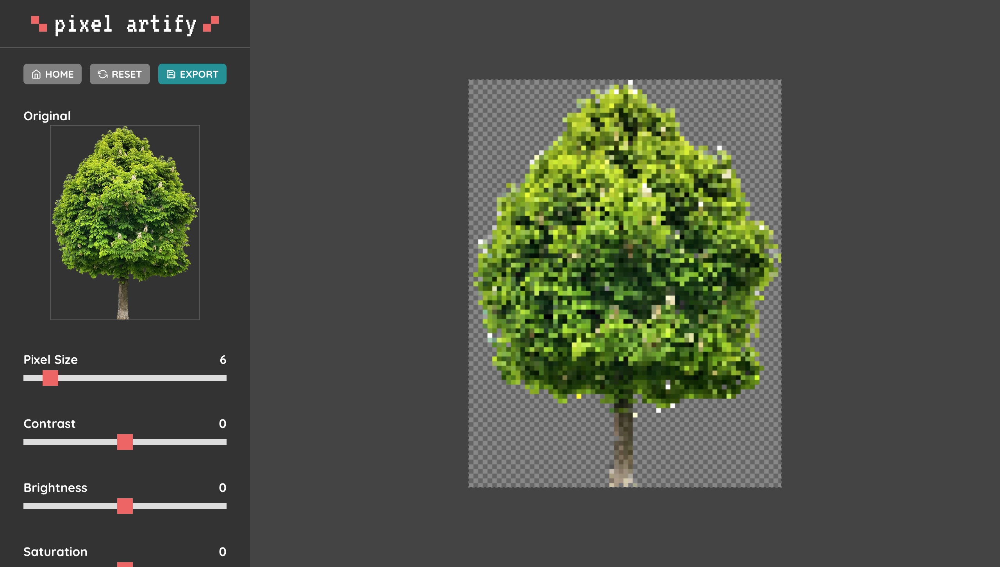

<br>

<p align="center">
  
</p>

## About The Project

Pixel Artify is a web-based tool for transforming images into pixel art. Try it out at [https://pixelartify.com](https://pixelartify.com)!




## Getting Started

### Prerequisites

This project requires Node.js which can be installed [here](https://nodejs.org/en/).

### Development Setup

1. Clone the repo:

```sh

git clone https://github.com/shannonlui/pixel-artify.git

```

2. Install the required dependencies in the client directory:

```sh

cd client
npm install

```

4. Run the client app in development mode:

```js

npm start

```


## Features
- [x] Pixelate uploaded images with customizable pixel size
- [x] Adjust contrast, brightness, saturation, and color palette
- [x] Paint, erase and color selection on canvas
- [ ] Resizable canvas and image export
- [ ] Zooming and panning the canvas
- [ ] Undo or redo changes


## Acknowledgments
This project was built using [React.js](https://reactjs.org/), Redux, and the following libraries:

* [Color Thief](https://github.com/lokesh/color-thief)
* [FileSaver.js](https://github.com/eligrey/FileSaver.js/) 
* [Pica](https://github.com/nodeca/pica)
* [React Color](https://github.com/casesandberg/react-color)
* [React Icons](https://github.com/react-icons/react-icons)

